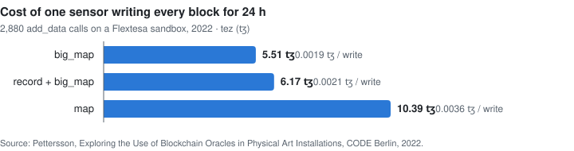
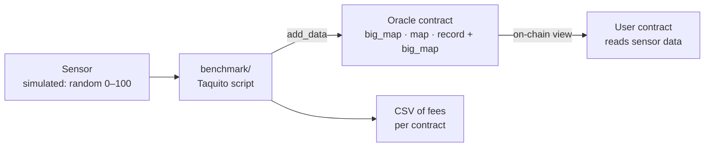

# tezos-art-oracles

**Blockchain oracles for physical art installations: three Tezos smart-contract designs that write sensor data to an immutable ledger, and a benchmark that measures what each one costs to run.**

<picture>
  <source media="(prefers-color-scheme: dark)" srcset="docs/cost-24h-dark.svg">
  
</picture>

<sub>Re-measured in 2026 on a Flextesa sandbox. The thesis figures from 2022 and why they differ are under <a href="#results">Results</a>.</sub>

## Why it exists

This is the code behind my bachelor's thesis, *Exploring the Use of Blockchain Oracles in Physical Art Installations* (Software Engineering, CODE University of Applied Sciences, Berlin, 2022).

The question: can an artist record what a physical installation's sensors measure on a public ledger, so the piece leaves a permanent, verifiable trace that outlives the installation itself? Blockchains can't see the outside world; an *oracle* is the bridge that brings external data on-chain. I built three oracle prototypes on Tezos, measured what each one costs to feed with sensor data, and interviewed installation artists about whether and how they would use it.

The short answer from the thesis: it works, but cost depends on how much data you write and how you store it, and artists want plug-and-play tooling rather than raw smart-contract development.

## How it works



All three oracles expose the same entrypoints (`add_data`, `add_sensor`, `remove_sensor`, `update_admin`, `withdraw`), only callable by the admin address, plus an on-chain `get_data` view (`oracle_map` also exposes `get_sensor_ledger`) that other contracts read with `Tezos.call_view`. They differ only in how they store readings:

| Prototype | Storage | Keeps history? |
|---|---|---|
| `oracle_bigmap` | `big_map` keyed by `(sensor_id, data_id)` | Yes, every reading |
| `oracle_map` | `map` keyed by `(sensor_id, data_id)` | Yes, every reading |
| `oracle_record_bigmap` | `big_map` keyed by `sensor_id` | No, latest value per sensor |

### Results

The [benchmark](benchmark) originates all three contracts on a [Flextesa](https://tezos.gitlab.io/flextesa/) sandbox and calls `add_data` once per block, with one sensor sending a random integer from 0 to 100. 2,880 writes is one day at one reading every 30 s.

**Re-measured (2026).** 200 writes per contract on the Oxford protocol. Cost is what the sender paid: baker fee plus the tez burned for new storage.

| Prototype | Fee / write | Storage burn / write | Total / write | Gas, first → last 10 writes | 24 h, projected |
|---|---:|---:|---:|---:|---:|
| `oracle_record_bigmap` | 386 µꜩ | 1 µꜩ | 387 µꜩ | 960 → 839 | ≈ 1.1 ꜩ |
| `oracle_map` | 358 µꜩ | 2,745 µꜩ | 3,103 µꜩ | 511 → 737 | ≈ 9 ꜩ, rising |
| `oracle_bigmap` | 364 µꜩ | 16,765 µꜩ | 17,129 µꜩ | 746 → 611 | ≈ 49 ꜩ |

- **Storage burn dominates.** Fees stay around 360–390 µꜩ for every design; the difference is how many new bytes each write pays for.
- **Keeping only the latest value is close to free.** `oracle_record_bigmap` overwrites one entry, so history has to live off-chain, for example in an indexer.
- **A `big_map` history costs the most per write.** Each new entry pays for about 67 bytes versus 11 in a `map`, because a big_map entry also stores the hash of its key.
- **A `map` history gets slower as it grows.** The whole map is loaded on every call, so gas rose 44 % over 200 writes; a long enough history would eventually hit the per-operation gas limit. A `big_map` is loaded lazily, so its gas stays flat.

**Thesis (2022).** 2,880 writes per contract on a Hangzhou sandbox with 3 s blocks, as published in the thesis:

| Prototype | 24 h total | Average per write |
|---|---|---|
| `oracle_bigmap` | 5.51 ꜩ | 0.0019 ꜩ |
| `oracle_record_bigmap` | 6.17 ꜩ | 0.0021 ꜩ |
| `oracle_map` | 10.39 ꜩ | 0.0036 ꜩ |

The 2022 benchmark computed each write's cost as `(fee + consumed gas) / 10⁶`: it added gas units to the mutez fee and left out the storage burn. Those figures mostly track gas, which is where `big_map`'s lazy loading wins, and they understate what a write cost. The re-measured numbers count what the sender actually paid.

## Repository layout

| Folder | What's inside | Originally |
|---|---|---|
| [`contracts/`](contracts) | The three oracle contracts and an example user contract, in CameLIGO, with compile, deploy and test scripts | `somaticbits/oracle` |
| [`benchmark/`](benchmark) | TypeScript (Taquito) script that deploys the oracles to a sandbox, writes data and records fees to CSV | `somaticbits/oracleTestingFramework` |
| [`dashboard/`](dashboard) | Grafana dashboard for monitoring a Tezos node (also used in [tezos-infra](https://github.com/somaticbits/tezos-infra)) | `somaticbits/grafana-tezos-dashboard` |

Full commit history of all three repositories is preserved.

## Run it

Requirements: Docker and Node.js 22+.

```bash
./contracts/run_sandbox.sh
cd benchmark
npm ci
STEPS=10 npm start
```

The sandbox serves RPC on port 20000; give it a few seconds to bake its first blocks. The compiled contracts are committed, so no LIGO install is needed. Leave out `STEPS` for a full day of 2,880 writes per contract (about 1.6 hours each). CSVs land in `benchmark/results/`; see the [benchmark README](benchmark/README.md) for settings and columns.

To recompile the contracts and run their LIGO tests (LIGO 0.38.1, in Docker):

```bash
./contracts/compile_all.sh
```

To deploy on a public testnet instead, use each contract's `originate.sh` (it targets the long-retired Hangzhou testnet; point it at a current one).

The benchmark signs with the Flextesa sandbox's built-in `alice` key, which is public and only valid on a local sandbox.

## Status

Built 2022 as a bachelor's thesis project at CODE University of Applied Sciences, Berlin, on the Tezos protocols of the time (Hangzhou, Ithaca). Updated in 2026 so it runs again: compiled contracts committed, the benchmark rewritten for Node 22 and Taquito 25 with corrected cost accounting, and CI that compiles and tests the contracts and runs the benchmark on a sandbox. Flextesa stopped publishing images in 2023, so the sandbox runs Oxford; costs on today's mainnet differ, but the comparison between designs holds.

## License

[MIT](LICENSE)
