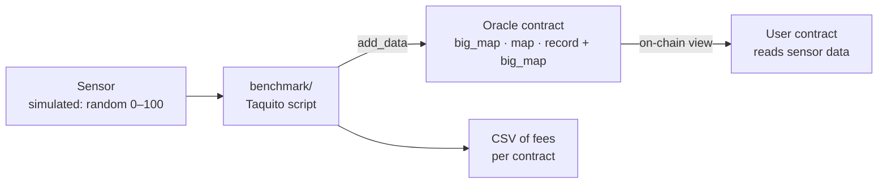

# tezos-art-oracles

**Blockchain oracles for physical art installations: three Tezos smart-contract designs that write sensor data to an immutable ledger, and a benchmark that measures what each one costs to run.**

<picture>
  <source media="(prefers-color-scheme: dark)" srcset="docs/cost-24h-dark.svg">
  
</picture>

## Why it exists

This is the code behind my bachelor's thesis, *Exploring the Use of Blockchain Oracles in Physical Art Installations* (Software Engineering, CODE University of Applied Sciences, Berlin, 2022).

The question: can an artist record what a physical installation's sensors measure on a public ledger, so the piece leaves a permanent, verifiable trace that outlives the installation itself? Blockchains can't see the outside world; an *oracle* is the bridge that brings external data on-chain. I built three oracle prototypes on Tezos, measured what each one costs to feed with sensor data, and interviewed installation artists about whether and how they would use it.

The short answer from the thesis: it works, but cost depends on how much data you write and how you store it, and artists want plug-and-play tooling rather than raw smart-contract development.

## How it works



All three oracles expose the same entrypoints (`add_data`, `add_sensor`, `remove_sensor`, `update_admin`, `withdraw`), only callable by the admin address, plus an on-chain `get_data` view (`oracle_map` also exposes `get_sensor_ledger`) that other contracts read with `Tezos.call_view`. They differ only in how they store readings:

| Prototype | Storage | Keeps history? |
|---|---|---|
| `oracle_bigmap` | `big_map` keyed by `(sensor_id, data_id)` | Yes, every reading |
| `oracle_map` | `map` keyed by `(sensor_id, data_id)` | Yes, every reading |
| `oracle_record_bigmap` | `big_map` keyed by `sensor_id` | No, latest value per sensor |

### Results

The benchmark deploys all three contracts to a [Flextesa](https://tezos.gitlab.io/flextesa/) sandbox (3 s blocks) and calls `add_data` 2,880 times per contract, one write per block for a full day at mainnet's 30 s block time, with one sensor sending a random integer from 0 to 100.

| Prototype | 24 h total | Average per write |
|---|---|---|
| `oracle_bigmap` | 5.51 ꜩ | 0.0019 ꜩ |
| `oracle_record_bigmap` | 6.17 ꜩ | 0.0021 ꜩ |
| `oracle_map` | 10.39 ꜩ | 0.0036 ꜩ |

`big_map` is the cheapest design: its entries are deserialized lazily, so a write doesn't pay to load the whole ledger. A plain `map` costs almost twice as much. Figures are from the thesis, measured in 2022; costs on today's Tezos protocol will differ.

## Repository layout

| Folder | What's inside | Originally |
|---|---|---|
| [`contracts/`](contracts) | The three oracle contracts and an example user contract, in CameLIGO, with compile, deploy and test scripts | `somaticbits/oracle` |
| [`benchmark/`](benchmark) | TypeScript (Taquito) script that deploys the oracles to a sandbox, writes data and records fees to CSV | `somaticbits/oracleTestingFramework` |
| [`dashboard/`](dashboard) | Grafana dashboard for monitoring a Tezos node (also used in [tezos-infra](https://github.com/somaticbits/tezos-infra)) | `somaticbits/grafana-tezos-dashboard` |

Full commit history of all three repositories is preserved.

## Run it

Requirements: Linux or macOS, Docker, Node.js 16, [LIGO](https://ligolang.org/docs/intro/installation) and `octez-client` (formerly `tezos-client`).

1. **Start a sandbox** (Flextesa, 3 s blocks, RPC on port 20000):
   ```bash
   ./contracts/run_hangzbox.sh
   ```
2. **Compile the contracts** to Michelson. Each `compile.sh` writes `main.tz` and `main_storage.tz`; set the admin address in `contracts/<prototype>/contracts/init_main_storage.mligo` to the sandbox's `alice` account first (`docker run --rm oxheadalpha/flextesa:latest hangzbox info`).
   ```bash
   for c in oracle_bigmap oracle_map oracle_record_bigmap; do (cd contracts/$c && ./compile.sh); done
   ```
3. **Run the unit tests** for a contract: `cd contracts/oracle_bigmap && ./run_tests.sh`.
4. **Run the benchmark.** It deploys all three contracts and writes one CSV per contract to `benchmark/src/results/`. At the default 4 s interval and 2,880 steps it takes about 3 hours per contract; change `intervalTime` and `intervalSteps` in `benchmark/src/config.ts` for a shorter run.
   ```bash
   cd benchmark
   npm install
   npm run dev
   ```

To deploy on a public testnet instead, use each contract's `originate.sh` (it targets the long-retired Hangzhou testnet; point it at a current one).

The benchmark signs with the Flextesa sandbox's built-in `alice` key, which is public and only valid on a local sandbox.

## Status

Built 2022 as a bachelor's thesis project at CODE University of Applied Sciences, Berlin, on the Tezos protocols of the time (Hangzhou, Ithaca). Kept as a reference project; the toolchain (LIGO, Flextesa `hangzbox`, Hangzhou testnet) has moved on, so expect to update versions before running it.

## License

[MIT](LICENSE)
