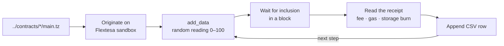

# benchmark

Originates the three oracle contracts from [`../contracts`](../contracts) on a local Flextesa sandbox, writes the same stream of readings to each, and records what every write cost, one CSV per contract.

## How it works



For each contract, `npm start` originates a fresh copy, then sends `STEPS` readings to sensor `0` one at a time. Each send waits for its operation to be included before the next, and its cost is read from the node's receipt:

- **fee**: the baker fee the sender paid.
- **storage burn**: tez burned for new bytes of contract storage (`paid_storage_size_diff` × the protocol's cost per byte).
- **total**: fee + storage burn, which is what the write cost the sender. Gas is recorded separately; its price is already part of the fee.

The default of 2,880 steps is one day at one reading every 30 seconds. The sandbox bakes a block every 2 seconds, so a full day per contract takes about 1.6 hours.

## Run it

Requirements: Node.js 22+ and Docker.

```bash
npm ci
npm run sandbox
npm start
```

`npm run sandbox` starts Flextesa on `localhost:20000` ([`../contracts/run_sandbox.sh`](../contracts/run_sandbox.sh)); give it a few seconds to bake its first blocks. Results land in `results/` (gitignored), and a summary table is printed after each contract. Stop the sandbox with `docker stop oracle-sandbox`.

Quick check:

```bash
STEPS=10 CONTRACTS=oracle_map npm start
```

`npm run deploy` only originates the contracts and prints their addresses.

### Configuration

| Variable           | Default                  | Meaning                                                                        |
| ------------------ | ------------------------ | ------------------------------------------------------------------------------ |
| `STEPS`            | `2880`                   | Readings written per contract                                                  |
| `INTERVAL_MS`      | `0`                      | Extra pause between readings, on top of waiting for each block                 |
| `CONTRACTS`        | all three                | Comma-separated subset, e.g. `oracle_map,oracle_bigmap`                        |
| `TEZOS_RPC_URL`    | `http://localhost:20000` | Node to talk to                                                                |
| `TEZOS_SECRET_KEY` | Flextesa `alice`         | Signing key; the default is the public sandbox key and only works on a sandbox |
| `RESULTS_DIR`      | `results`                | Where CSVs are written                                                         |

The contracts' initial storage makes `alice` the admin, so another key needs recompiled storage.

### CSV columns

`step, timestamp, value, feeMutez, consumedMilligas, storageDiffBytes, storageBurnMutez, totalMutez`, one row per reading. Rows are appended as the run goes, so an interrupted run keeps what it measured.

### Development

```bash
npm run lint
npm run typecheck
npm test
```

CI runs these, then a three-reading run against a real sandbox.

## History

The first version (2022) read a DHT temperature sensor on a Raspberry Pi and was switched to simulated readings so runs could be repeated. It reported `(fee + consumed gas) / 10⁶` as the total, which adds gas units to mutez and leaves out the storage burn, so the thesis figures track gas rather than what a write cost. The 2026 rewrite reads costs from the receipts and runs on Node 22, Taquito 25 and the Oxford protocol.
